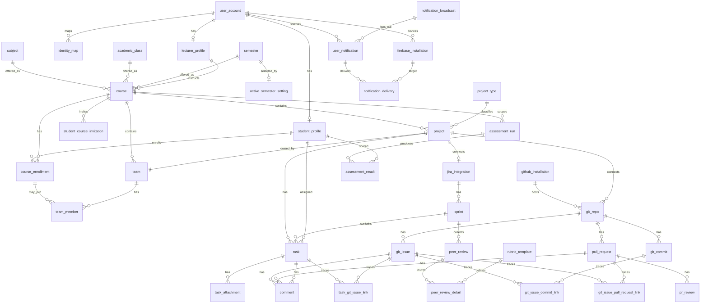
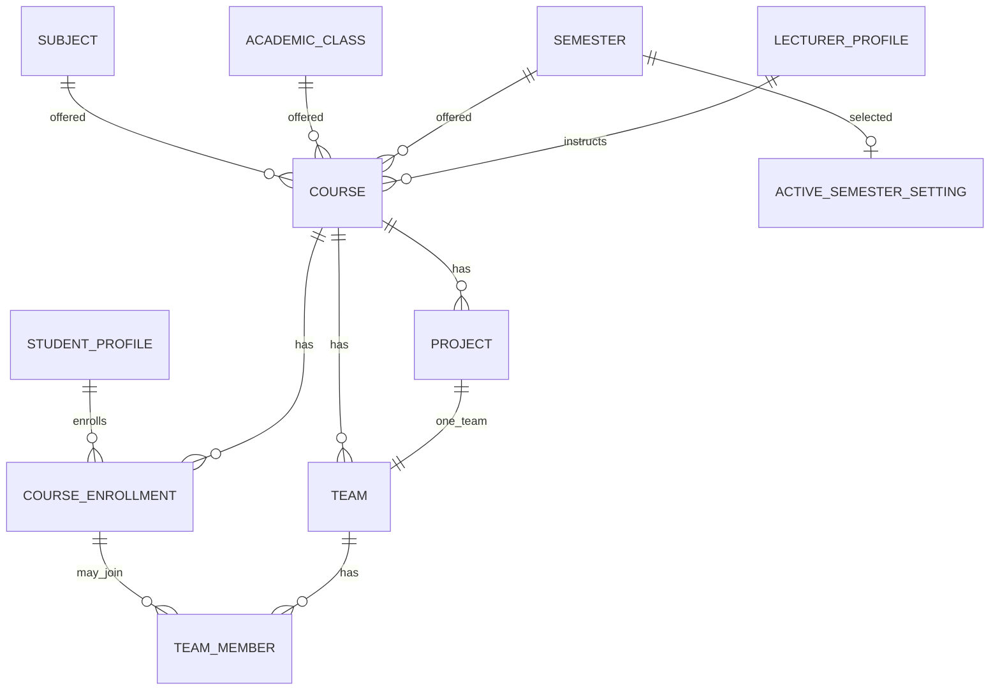
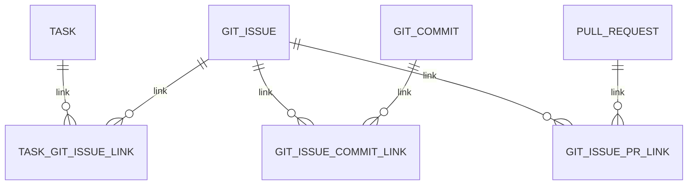

# SAGA V2 ERD

Greenfield MySQL 8.4 schema. Flyway: `V1__initial_schema.sql` (immutable baseline) + `V2__user_account_password_hash_and_comment_task.sql`.

This document describes the **52** tables created by V1. It is not a migration of the old database.

UUID primary keys are `CHAR(36)` except `active_semester_setting.singleton_id` (`TINYINT`, always `1`). That singleton key is the only non-UUID PK; it is required by the singleton design. External provider identifiers (GitHub numeric ids, commit SHA, Jira keys) are never used as SAGA PKs.

Default FK action is MySQL `RESTRICT` / `NO ACTION`. `ON DELETE CASCADE` is used only where the child is owned evidence, a join row, or a delivery row of a parent notification.

---

## Domain groups

| Group | Tables |
| --- | --- |
| Account / identity | `user_account`, `student_profile`, `lecturer_profile`, `student_course_invitation` |
| Academic | `subject`, `academic_class`, `semester`, `active_semester_setting`, `course`, `course_enrollment` |
| Project / team | `project_type`, `project`, `team`, `team_member` |
| Jira | `jira_integration`, `sprint`, `task`, `task_attachment`, `jira_write_operation` |
| GitHub / traceability | `github_installation`, `git_repo`, `git_issue`, `pull_request`, `git_commit`, `pr_review`, `comment`, `task_git_issue_link`, `git_issue_commit_link`, `git_issue_pull_request_link`, `commit_review_intent`, `commit_review_result` |
| Integration / sync | `identity_map`, `identity_mapping_history`, `webhook_receipt`, `sync_job_log` |
| Assessment / contribution | `peer_review`, `peer_review_detail`, `rubric_template`, `project_group_weight_config`, `contribution_override`, `assessment_run`, `assessment_result` |
| Notification / email / Firebase | `user_notification`, `notification_broadcast`, `notification_delivery`, `firebase_installation`, `email_outbox` |
| Warning | `business_warning` |
| AI Agent | `ai_agent_delegation_context`, `ai_agent_conversation_scope` |
| Graph | `graph_processing_run` |
| Infrastructure | `outbox_event` |

**Total: 52 tables.**

---

## Cardinalities (core)

```text
user_account 1──1 student_profile
user_account 1──1 lecturer_profile
user_account 1──* identity_map          (unique per provider)
user_account 1──* user_notification
user_account 1──* firebase_installation

subject *──* academic_class *──* semester
        \         |            /
         └──── course ────────┘
course.instructor → lecturer_profile (N:1, nullable)

student_profile 1──* course_enrollment *──1 course
course_enrollment 1──* team_member *──1 team
team *──1 course
team 1──1 project                    (uk_team_project)
project *──1 course
project 1──1 jira_integration        (nullable until connected)
project 1──* git_repo
jira_integration 1──* sprint
sprint 1──* task
project 1──* task

task *──* git_issue                  via task_git_issue_link
git_issue *──* git_commit            via git_issue_commit_link
git_issue *──* pull_request          via git_issue_pull_request_link

assessment_run *──1 course
assessment_run 1──* assessment_result *──1 student_profile
```

Jira and GitHub both hang off `project` independently. There is no FK from Jira tables to GitHub tables or the reverse.

---

## Overview Mermaid ER diagram



---

## Table catalog

Columns listed are the main business columns. Every UUID entity also has `id`, `created_at`, `updated_at` unless noted.

### 1. `user_account`

Provider-neutral login identity. Common account fields live here, not on student/lecturer tables.

| | |
| --- | --- |
| PK | `id` |
| Unique | `email` |
| Indexes | `(account_role, account_status)` |
| Main columns | `email`, `full_name`, `avatar_url`, `password_hash`, `account_role`, `account_status` |
| FK | none |

`password_hash` is nullable (OIDC-only accounts may have no local password). Schema stores Argon2id `PasswordEncoder` output only (DEC-017) — never plaintext. `PasswordEncoder` is configured; login/registration are **not** implemented. No `cognito_sub`. Session/access/refresh token tables are **not** created until that architecture is finalized.

### 2. `student_profile`

| | |
| --- | --- |
| PK | `id` |
| Unique | `user_account_id`, `student_code` (nullable unique) |
| Main columns | `student_code`, `approved_by_user_id`, `approved_at`, `version` |
| FK | `user_account_id` → `user_account`; `approved_by_user_id` → `user_account` |

### 3. `lecturer_profile`

| | |
| --- | --- |
| PK | `id` |
| Unique | `user_account_id` |
| FK | `user_account_id` → `user_account` |

### 4. `student_course_invitation`

Invitation/outbox-style join email for a student into a course. Not course membership authority.

| | |
| --- | --- |
| PK | `id` |
| Unique | `(student_profile_id, course_id, invitation_type)` |
| Indexes | `invitation_status` |
| FK | student, course |

### 5. `subject`

Academic catalog. Soft-delete via `deleted_at`. Unique `subject_code`.

### 6. `academic_class`

Java entity: `AcademicClass`. Unique `class_code`. Soft-delete `deleted_at`.

### 7. `semester`

Unique `code`. Optional `start_date` / `end_date`. Soft-delete `deleted_at`.

### 8. `active_semester_setting`

Singleton. PK `singleton_id` CHECK `= 1`. Seeded row `(1, NULL)`.

| | |
| --- | --- |
| PK | `singleton_id` |
| FK | `semester_id` → `semester`; `updated_by_user_id` → `user_account` |
| Audit | `updated_at` |

Does not extend `BaseEntity`.

### 9. `course`

Offering instance: subject + academic class + semester + optional instructor.

| | |
| --- | --- |
| PK | `id` |
| Unique | `id` (redundant, supports composite-FK style lookups) |
| Indexes | `(semester_id, instructor_id)`, `subject_id`, `academic_class_id` |
| Weights | `code/test/document/research_contribution_weight`, `contribution_config_mode` |
| FK | subject, academic_class, semester, instructor → `lecturer_profile` |
| Soft-delete | `deleted_at` |

### 10. `course_enrollment`

**Authority for Student ↔ Course membership.**

| | |
| --- | --- |
| PK | `id` |
| Unique | `(student_profile_id, course_id)`, `(id, course_id)` |
| Indexes | `course_id` |
| Main columns | `enrollment_status`, `enrolled_at` |
| FK | student_profile, course |

`(id, course_id)` exists so `team_member` can require enrollment and team to share the same course.

### 11. `project_type`

Catalog. Seeded: `DESIGN_ARCHITECTURE`, `RESEARCH`, `TESTER`, `DOCUMENT`. Unique `code`. `criteria_config` TEXT.

### 12. `project`

| | |
| --- | --- |
| Indexes | `course_id` |
| FK | course, project_type, created_by → user_account |
| Main columns | `name`, `description`, `repository_url` |

`repository_url` is display/convenience only. GitHub SoT is `git_repo`.

### 13. `team`

| | |
| --- | --- |
| Unique | `project_id` (one team per project), `(id, course_id)` |
| Indexes | `course_id` |
| FK | course, project |

### 14. `team_member`

Tied to a valid enrollment in the **same** course as the team.

| | |
| --- | --- |
| Unique | `(team_id, course_enrollment_id)` |
| Indexes | `course_enrollment_id` |
| FK | `(team_id, course_id)` → `team (id, course_id)`; `(course_enrollment_id, course_id)` → `course_enrollment (id, course_id)` |
| Main columns | `role_in_team` |

Cross-course team membership is rejected by the database.

### 15. `jira_integration`

SAGA ↔ Jira connection for a project. Replaces old `jira_board`.

| | |
| --- | --- |
| Unique | `project_id`; `(cloud_id, jira_project_id)` |
| Main columns | cloud/site/project/board identifiers, encrypted tokens, webhook metadata, `sync_cursor`, `connection_status`, `version` |
| FK | project, connected_by → user_account |

Jira does not reference GitHub.

### 16. `sprint`

| | |
| --- | --- |
| Unique | `(jira_integration_id, external_sprint_id)` |
| FK | jira_integration |
| Soft-delete | `deleted_at` |

### 17. `task`

| | |
| --- | --- |
| Unique | `(project_id, external_id)` |
| Indexes | `(project_id, sprint_id)`, `assignee_student_id`, `due_date`, `external_key` |
| FK | project, sprint, assignee/reporter student, self `blocks_task_id` |

No `task_web_link` fields. External assignee/reporter ids preserved for unmapped Jira accounts.

### 18. `task_attachment`

Unique `(task_id, external_id)`. FK task **ON DELETE CASCADE**.

### 19. `jira_write_operation`

Idempotent outbound Jira writes. Unique `(project_id, idempotency_key)`.

### 20. `github_installation`

Unique GitHub App `installation_id`. Independent of Jira.

### 21. `git_repo`

| | |
| --- | --- |
| Unique | `(provider, repository_id)`, `(project_id, full_name)` |
| FK | project, github_installation |

### 22. `git_issue`

Unique `(repo_id, github_issue_id)`, `(repo_id, issue_number)`. FK repo **ON DELETE CASCADE**.

### 23. `pull_request`

Unique `(repo_id, github_pull_request_id)`, `(repo_id, pull_number)`. **No** `task_id` / `git_issue_id` columns.

### 24. `git_commit`

Unique `(repo_id, sha_hash)`. Index `sha_hash`. **No** `task_id` / `git_issue_id` / `pr_id`.

### 25. `pr_review`

Unique `(pull_request_id, github_review_id)`. FK PR **ON DELETE CASCADE**.

### 26. `comment`

Optional `git_issue_id` / `pull_request_id` / `task_id` / `parent_comment_id`. `task_id` is a nullable FK → `task.id` (ON DELETE CASCADE), restored in Flyway V2. This is a comment target, not a competing traceability model on PR/commit.

### 27–29. Traceability links

Canonical graph. `relation_type` on every link. Unique pair keys. FKs **ON DELETE CASCADE**.

```text
task ── task_git_issue_link ── git_issue
git_issue ── git_issue_commit_link ── git_commit
git_issue ── git_issue_pull_request_link ── pull_request
```

### 30. `commit_review_intent`

Unique `(git_repo_id, sha_hash)`.

### 31. `commit_review_result`

Unique `intent_id`, unique `ai_job_id`. Findings stored as MEDIUMTEXT JSON fragments.

### 32. `identity_map`

User-centric. Unique `(user_account_id, provider)`, `(provider, external_account_id)`. Not tied to Cognito.

### 33. `identity_mapping_history`

Append-only mapping actions. Index `identity_map_id`.

### 34. `webhook_receipt`

Inbound webhook idempotency. Unique `(provider, delivery_id)`. Index `(receipt_status, created_at)`. No FK (target may be Jira or GitHub).

### 35. `sync_job_log`

Sync history. Index `(status, started_at)`. No FK.

### 36. `peer_review`

Unique `(sprint_id, reviewer_student_id, reviewee_student_id)`.

### 37. `peer_review_detail`

FK peer_review **ON DELETE CASCADE**, rubric_template RESTRICT.

### 38. `rubric_template`

Optional `subject_id`. Soft-delete `deleted_at`.

### 39. `project_group_weight_config`

Unique `project_id`. Per-project-group contribution weights when `contribution_config_mode = PROJECT_GROUP`.

### 40. `contribution_override`

Actual override row (not an approval workflow). Course required; team/student optional.

### 41. `assessment_run`

Historical calculation run. Scope: course required; project/sprint optional. Index `(course_id, sprint_id)`.

### 42. `assessment_result`

Unique `(assessment_run_id, student_profile_id)`. Scores + `breakdown_json`.

### 43. `user_notification`

Recipient is always `user_account`. Unique `(broadcast_id, recipient_user_id)`, `(recipient_user_id, event_key)`. Inbox index `(recipient_user_id, created_at)`.

### 44. `notification_broadcast`

Unique `(sender_user_id, idempotency_key)`.

### 45. `notification_delivery`

Unique `(notification_id, installation_id)`. FK notification **ON DELETE CASCADE**. Index `delivery_status`.

### 46. `firebase_installation`

Unique `firebase_installation_id`. Index `(owner_user_id, active)`. Schema is present; enabling FCM remains optional at the product/runtime layer.

### 47. `email_outbox`

Generic transactional mail. Nullable `recipient_user_id`. Index `(delivery_status, scheduled_at)`.

### 48. `business_warning`

Unique `event_key`. Optional FKs to course, team, project, sprint, student. Index `course_id`.

### 49. `ai_agent_delegation_context`

Unique `token_hash`. Actor is `user_account`.

### 50. `ai_agent_conversation_scope`

Unique `conversation_id`. No conversation/message transcript tables.

### 51. `graph_processing_run`

Projection/build metrics only. No `created_at`/`updated_at`. Indexes on `occurred_at` and `(graph_kind, occurred_at)`. Does not store Neo4j nodes/edges.

### 52. `outbox_event`

Transactional outbox. Index `(status, available_at)` for polling. JSON `payload`. Not coupled to Neo4j.

---

## Academic Mermaid



## Traceability Mermaid



## Outbox / projection path (not dual-write)

```text
MySQL transaction
    → outbox_event
    → RabbitMQ (later)
    → async consumers (later)
    → Neo4j projection / other processors (later)
```

`graph_processing_run` records projection attempts. Neo4j is rebuildable and is not mirrored as MySQL graph rows.
